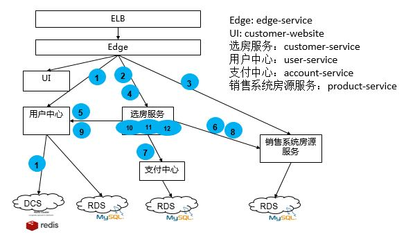
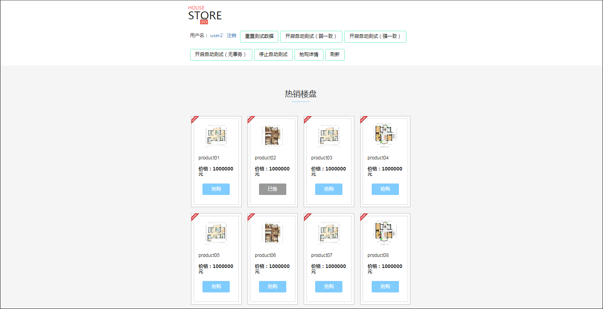

**警告：** 这个项目仅用于学习使用，请勿用于生产代码。   
**警告：** 代码中认证逻辑等处理，是为了演示方便设计的，并不能作为生产代码使用。    
**警告：** 代码中事务处理，是为了演示方便设计的，可以结合业务做好规划和性能调优。比如避免lock & update，而使用update on condition等提升事务性能。   
**警告：** 作者不对由于使用本代码，导致的任何产品故障负责。     

# 功能介绍
1. 演示微服务开发多个微服务，包括WEB、REST服务以及Edge服务；
2. 演示TCC事务控制数据一致性；
3. 演示两阶段提交控制数据一致性。

# 系统组成

# 抢购业务流程
1. 登录校验（调用用户中心服务）
2. 展示选房场次列表（调用选房服务查询）
3. 进入一个选房场次，展示选房详情和可选房间（调用销售系统房源查询服务）
4. 选定一个房间点击秒杀抢房（选房服务），**开启分布式事务**
5. 检查用户可用余额并冻结房间价格对应金额（用户中心服务）
6. 锁定房源（调用销售系统服务）**5,6两步可以异步发起**
7. 等5,6两步都成功后，扣减房间金额（调用支付中心）
8. 更新房源（调用销售系统服务）
9. 更新用户可用余额（用户中心）
10. 更新选房结果（选房服务）
11. 提交事务
12. 刷新选房详情页面（查询选房服务）

# 部署参考
1. 安装mysql，并配置dbcp.properties，建表脚本在对应的微服务目录下，包括account-service/product-service/user-service三个服务的表；
2. 安装redis，配置信息在microservice.yaml，用于TCC事务日志存储；
3. 安装tomcat，部署customer-website的war包，应用路径设置为/，监听端口保持和microservice.yaml的端口一致。 
4. 启动8个微服务，除了customer-website，其他服务均可以使用IDE运行；或者mvn install后，使用java -jar {微服务jar名称}.jar运行
5. 资源需求：每个微服务配置1C2G的资源，8个微服务总共8C16G。

# 关键流程
## 界面操作
1. 输入http://localhost:18080/ui/customer-website/login.html ，使用用户名密码登陆(user2/test)。登陆逻辑做了特殊处理，没有用户数据的时候也是可以登陆的。
2. 登陆后点击“重置测试数据"，刷新，即可生成测试数据。重置数据会生成user1~user100，重置数据后，在使用user2/test重新登陆，即可进行抢购等操作。
	 * User-Service: 创建100个用户，每个定金账号设置10,000,000
	 * Account-Service: 创建100个用户，每个定金账号设置8,000,000
	 * Product-Service: 创建100个房源，每个房间价格1,000,000
3. 界面展示

## 基本功能演示
1. 初始化数据
2. 调用/api/customer-service/buy(userId=1,productId=1,price=9000000)，提示价格错误
3. 调用/api/customer-service/buy(userId=1,productId=1,price=1000000)，提示抢购成功
4. 调用/api/customer-service/buy(userId=1,productId=1,price=1000000)，提示房屋已被抢购
5. 调用/api/customer-service/buy(userId=1,productId=2,price=1000000)
   调用/api/customer-service/buy(userId=1,productId=3,price=1000000)
   调用/api/customer-service/buy(userId=1,productId=4,price=1000000)
   调用/api/customer-service/buy(userId=1,productId=5,price=1000000)
   调用/api/customer-service/buy(userId=1,productId=6,price=1000000)
   调用/api/customer-service/buy(userId=1,productId=7,price=1000000)
   调用/api/customer-service/buy(userId=1,productId=8,price=1000000)
   调用/api/customer-service/buy(userId=1,productId=9,price=1000000)， 提示支付失败

## 性能测试
  1. 可以模拟100 * 100(userId和productId的组合）个不同条件的并发(参考PerformanceClient测试用例)。 通过设置错误的price/userid/productid，可以设置异常条件。    
  2. 通过接口查询数据是否一致
       100*10,000,000 - 余额(User-Service) = 已售楼盘余额(Product-Service) = 100*8,000,000  - 余额(Account-Service)
    /api/customer-service/balance

# 抢购流程

* 开启分布式事务     

** Try过程：       
1.调用抢购(选房服务Customer-Service)   
2.检查用户可用余额并冻结房间价格对应金额（用户中心服务User-Service）   
3.锁定房源（销售系统服务Product-Service）   
4.扣减房间金额（支付中心服务Account-Service）   

** Confirm过程     
5.更新用户可用余额（用户中心服务User-Service）   
6.更新房源（销售系统服务Product-Service）    
7.更新用户可用余额（支付中心服务Account-Service）   
8.完成抢购，输出抢购结果(选房服务Customer-Service)   

* 提交事务     

